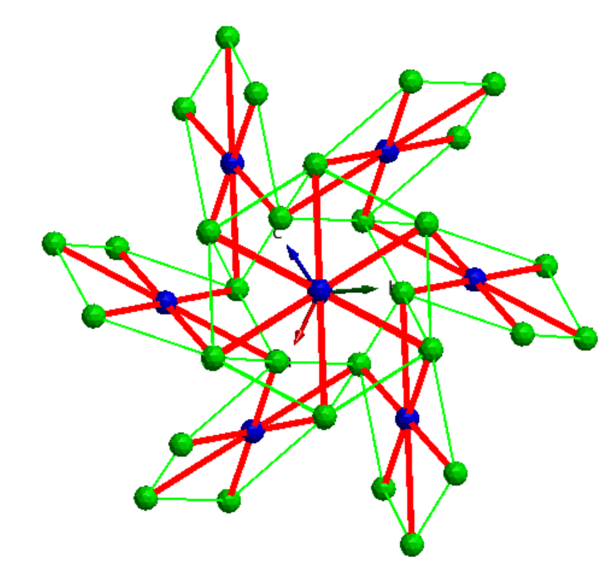
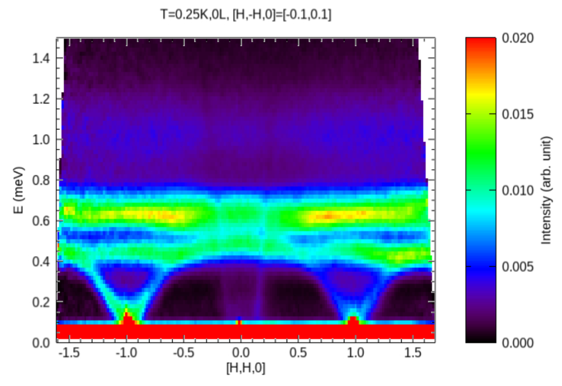
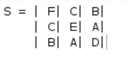
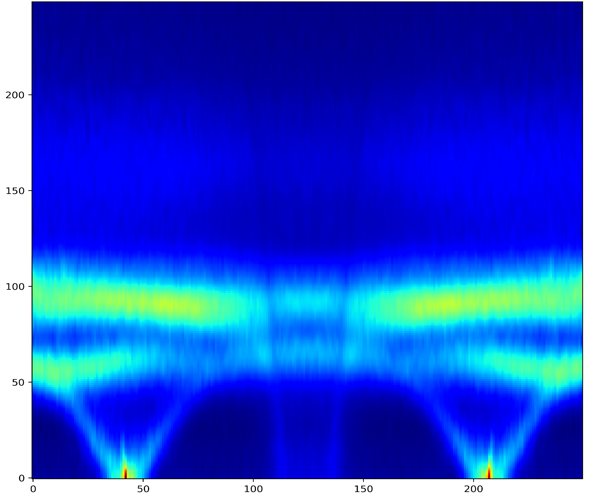
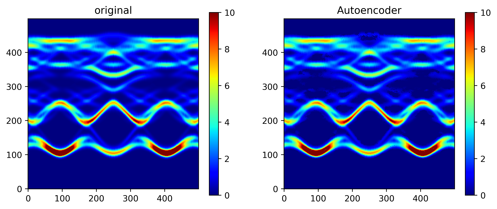

# Spin-AI

Spin-AI is a prototype being actively developed to model inelastic neutron scattering data. It is construct by interfering an auto encoder with a feed-forward neural network.

# Motivation - Yb2O3

The $Yb_2O_3$ is a binary system with complex chiral structural. The $Yb$ is the only magnetic ion in the system yet they occupy two different symmetry sites(See picture below). The spin Hamiltonian is governed by two exchange interactions $J_1$ and $J_2$. Symmetry allows 12 free parameters to poppulate two 3 $\times$ 3 matrices for the exchange interactions. Fitting these parameters with inelastic neutron scattering data has been challenging.

For example, how would you fit a spin wave data that looks like this:

# Dimension Reduction(PCA, Autoencoder)
The goal for Spin-AI is to discover a hidden relationship between the two exchange matrices of the form:

to the inelastic neutron data above.

A simple PCA algorithm that relies on linear eigen-decomposition has proven to be able to accurately re-construct neutron data using 128 dimensions. To study the non-linear relationships between the latent space and neutron data we deploy a prototypical auto-enocder and trains it on 2000 simulated images. The results looks like this:

.

# Autoencoder + Feed Forward Neural Network

However our goal is not image2image but image-to-parameter. To extract the relationship between the latent space we now interfere our autoencoder with a Feed-forward neural network and train the global MSR loss using PyTorch. Working on synthetic data, Spin-AI is able to succesfully 

.
